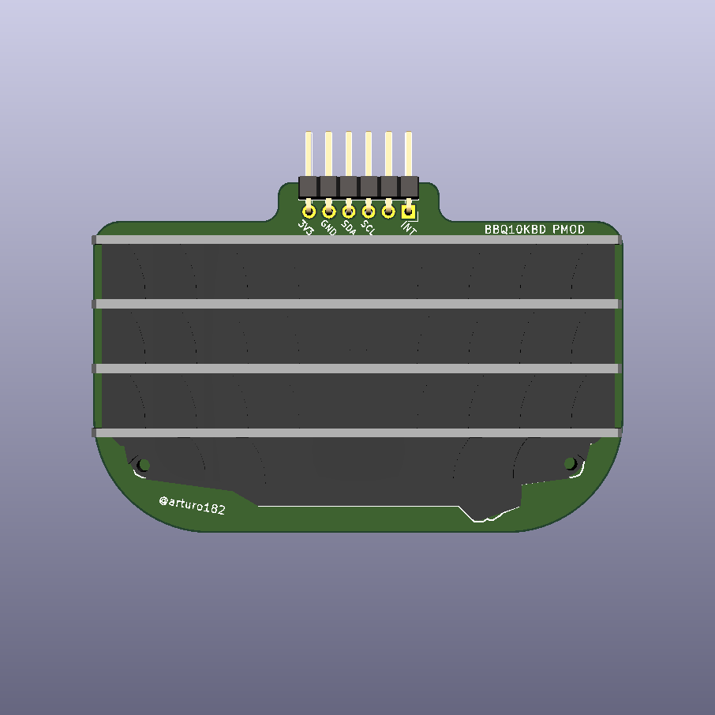
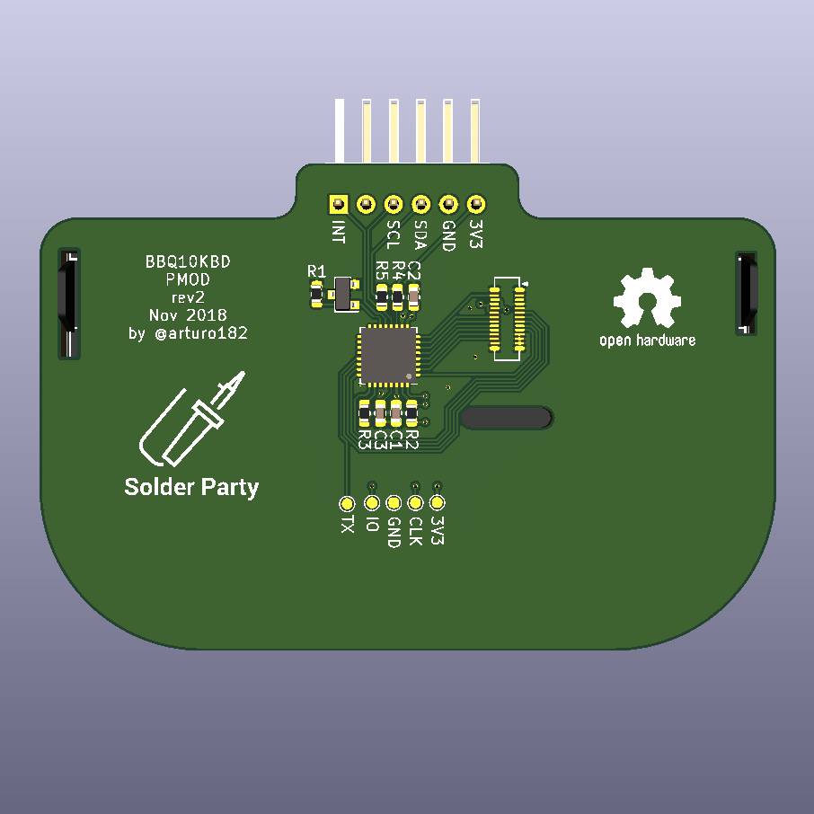
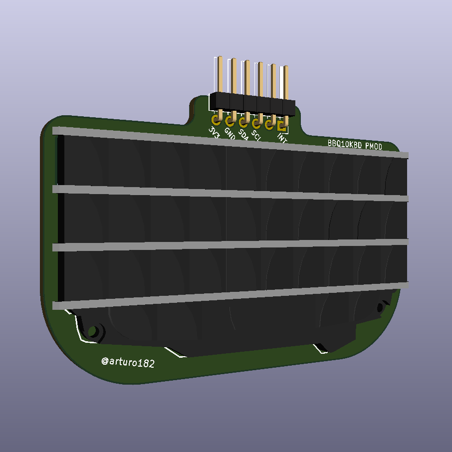

# BB Q10 Keyboard PMOD

A BB Q10 Keyboard in PMOD format!

This board uses a ATSAMD20 chip as a i2c slave that can be polled to get the key FIFO, the firmware for the SAM can be found here: https://github.com/arturo182/bbq10kbd_i2c_sw

The SAM chip also controls the backlight of the keyboard, the backlight brightness can be controlled over I2C as well.

A kernel module for the Raspberry Pi is available here: https://github.com/arturo182/bbq10pmod_module
